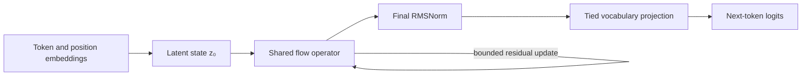

# FlowReasoning

An experimental character-level language model that treats depth as an iterative evolution of a latent state.

Most language models pass activations through a stack of distinct transformer blocks. FlowReasoning instead reuses one operator for several small updates:

```text
tokens -> embeddings -> z₀ -> z₁ -> ... -> zₜ -> next-token logits
```

The project is deliberately small enough to inspect and run on a CPU. It is a research prototype, not a claim that latent flow updates outperform a standard
transformer. Its purpose is to make the architecture easy to experiment with and to expose diagnostics for the iterative computation.

In a three-seed Tiny Shakespeare ablation, four applications of the shared latent operator improved validation BPC from 3.008 ± 0.090 to 2.501 ± 0.019 under the same training-step budget. A four-branch variant was slower and performed worse at 2.670 ± 0.034 BPC. The result supports repeated shared computation in this small experiment but not the learned-branch mechanism.

>**Scope:** The project name refers to iterative latent computation. The current task is next-character prediction and does not constitute a reasoning benchmark.

## What is implemented

Each update combines:

- causal self-attention with rotary position embeddings;
- an FFT-based causal sequence mixer;
- a diagonal complex-valued feature rotation;
- a gated SwiGLU residual branch; and
- a learned step size with bounded updates.

The same operator is reused at every flow step. In `paths` mode, several learned latent branches are initialized with distinct branch embeddings, evolved through the shared operator, and merged using learned sequence-level weights. These branches are architectural components rather than independent Monte Carlo samples.

> **Terminology:** "flow" describes the repeated, controlled evolution of the latent state. The model is not an invertible normalizing flow and does not compute a Jacobian determinant.

## Preliminary architecture comparison

I compared three variants on Tiny Shakespeare using three training seeds
(11, 22, and 33), a shared contiguous train/validation split, fixed validation
windows, and the same 3,000-step optimization budget.

| Architecture | Updates | Learned branches | Validation BPC | Wall time |
|---|---:|---:|---:|---:|
| Single trajectory | 1 | 1 | 3.0084 ± 0.0900 | 0.2 min |
| Single trajectory | 4 | 1 | 2.5008 ± 0.0190 | 0.5 min |
| Learned branches | 4 | 4 | 2.6704 ± 0.0336 | 0.9 min |

Applying the shared latent operator four times reduced validation BPC by
0.5076 ± 0.0905 relative to applying it once. The improvement occurred for all
three seeds, although the four-update model required approximately 2.37 times
the wall-clock time.

Adding four learned branches did not improve the four-update model. It increased
validation BPC by 0.1696 ± 0.0200 and required approximately 1.74 times the
wall-clock time of the single-trajectory four-update model. Effective branch
count ranged from 3.06 to 3.17 on the saved training batches, indicating that
the aggregation had not simply collapsed onto a single branch.

These results suggest that repeated shared computation was useful in this
fixed-budget character-model experiment, while the learned-branch mechanism did
not justify its additional cost.

All configurations selected the final training step as their best checkpoint,
so the experiment should be interpreted as a fixed-budget comparison rather
than a converged comparison. Tiny Shakespeare is also small and stylistically
narrow, and the task measures next-character prediction rather than reasoning
ability.


## Current status

The repository includes a deterministic held-out evaluation pipeline and a
three-seed Tiny Shakespeare architecture ablation.

The experiment supports repeated use of the shared latent operator under the
tested training budget. It does not support the current learned-branch
mechanism, which was slower and performed worse than the four-update
single-trajectory model.

These findings are preliminary and specific to a small character-level task.
They do not establish an advantage over standard transformer architectures or
measure reasoning ability.

## Quick start

FlowReasoning requires Python 3.10+ and PyTorch 2.1+.

```bash
python -m venv .venv
source .venv/bin/activate
pip install -r requirements.txt

# Short CPU smoke test
python main.py train \
  --training-steps 20 \
  --seq-length 64 \
  --batch-size 8 \
  --dim 64 \
  --num-heads 4

python main.py generate \
  --checkpoint checkpoints/flow_reasoning.pt \
  --prompt "The latent state"
```

The built-in corpus only exists to verify the training pipeline. For a meaningful
experiment, supply a UTF-8 text file:

```bash
python main.py train \
  --data-path data/corpus.txt \
  --training-steps 1000 \
  --seq-length 128 \
  --batch-size 16
```

To compare a single trajectory with four learned trajectories:

```bash
python main.py train --executor-mode paths --num-paths 4
```

## Architecture



The main implementation lives in [`src/core.py`](src/core.py). `FlowEvolver`
owns the repeated latent update and optional learned-branch aggregation
`FlowReasoningLM` in [`src/model.py`](src/model.py) provides the language-model
interface and autoregressive generation.

## Diagnostics

Training reports cross-entropy loss, perplexity, elapsed time, and latent-update
statistics. Path mode additionally records:

- normalized weight for each trajectory;
- variance between latent trajectories; and
- effective branch count, an inverse-concentration diagnostic showing whether
  the learned aggregation distributes weight across several branches or
  concentrates on one.

Checkpoints contain the model configuration, tokenizer vocabulary, parameters,
final loss, and the latest diagnostics. A checkpoint is therefore self-contained
for inference; reproducing training also requires the original corpus.

Branch variance and inverse weight concentration describe internal branch diversity. They are not calibrated uncertainty estimates.

## Development

Install the development extras and run the test suite:

```bash
pip install -e '.[dev]'
pytest
```

The tests cover tokenization, batching, both execution modes, configuration
validation, and checkpoint round-tripping.

## Current limitations

- Tokenization is character-level, so results are not comparable with modern
  subword language models.
- Generation recomputes the full context and does not use a KV cache.
- The included corpus is a smoke-test fixture, not a training dataset.
- There is no benchmark against a parameter-matched transformer yet.

These are the next useful directions: add a validation split, compare against a
small transformer baseline, and measure how path diversity changes during
training.

## License

[MIT](LICENSE)
